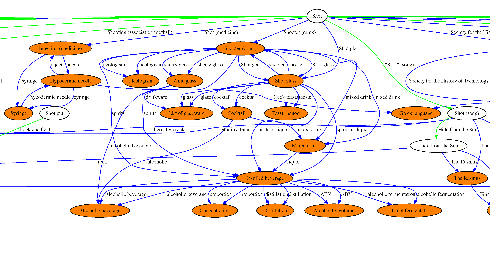

Create a directed graph of linked Wikipedia articles based on a disambiguation page which can be used to disambiguate words.

This is from my time as an undergraduate research assistant at the Center for Intelligent Systems and Machine Learning, University of Tennessee. Last updated 2014.

# Requirements
- python2.7
- requests (http://docs.python-requests.org/en/latest/)
- mwlib (http://mwlib.readthedocs.org/en/latest/)

# Installation
To install mwlib:
	sudo pip install -i http://pypi.pediapress.com/simple/ mwlib

To install requests:
	sudo pip install requests

# Usage
python main.py [--num-levels] [--num-disambig-links] [--num-page-links] [--overwrite] disambiguation-term

# Example
Cropped example for the word "shot". For full graph, see [here](shot_duplicates.pdf).

