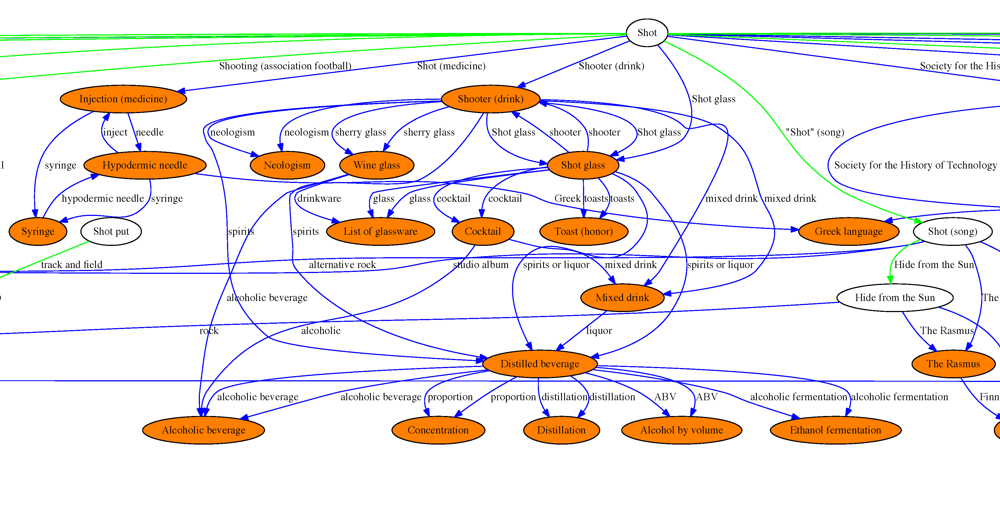

Create a directed graph of linked Wikipedia articles based on a disambiguation page which can be used to disambiguate words.

This is from my time as an undergraduate research assistant at the Center for Intelligent Systems and Machine Learning, University of Tennessee. Originally created in 2014, modernized in 2025.

# Requirements
- Python 3.10 or higher
- requests (https://requests.readthedocs.io/)
- mwparserfromhell (https://mwparserfromhell.readthedocs.io/)

# Installation

## Using pip
```bash
pip install -r requirements.txt
```

This will install:
- `requests` for HTTP requests to Wikipedia API
- `mwparserfromhell` for parsing MediaWiki wikitext

## For graph visualization (optional)
```bash
pip install pygraphviz
```

Note: pygraphviz requires graphviz to be installed on your system first:
- Ubuntu/Debian: `sudo apt-get install graphviz graphviz-dev`
- macOS: `brew install graphviz`
- Windows: Download from https://graphviz.org/download/

## Recent Changes (Phase 2 - October 2025)
- ✅ **Replaced mwlib with mwparserfromhell**: The deprecated mwlib library has been completely replaced with the modern, actively-maintained mwparserfromhell parser
- ✅ **Improved parsing**: Simpler, more maintainable code using mwparserfromhell's clean API
- ✅ **Better Python 3 support**: No more compatibility issues with modern Python versions
- ✅ **Comprehensive testing**: Added unit tests, integration tests, and end-to-end pipeline tests

## Testing

Comprehensive test suite to validate the modernization:

```bash
# Phase 1: Python 3 migration tests
python3 test_python3_migration.py
python3 test_syntax.py
python3 test_modernization_features.py

# Phase 2: mwparserfromhell integration tests
python3 test_mwparserfromhell_api.py      # Parser API validation
python3 test_real_wikipedia_parsing.py     # Article parsing tests
python3 test_end_to_end_mock.py           # Complete pipeline test
```

All tests pass! ✅

See `VALIDATION_REPORT.md` for Phase 1 results.

# Usage
python main.py [--num-levels] [--num-disambig-links] [--num-page-links] [--overwrite] disambiguation-term

# Example
Cropped example for the word "shot". For full graph, see [here](shot_duplicates.pdf).


